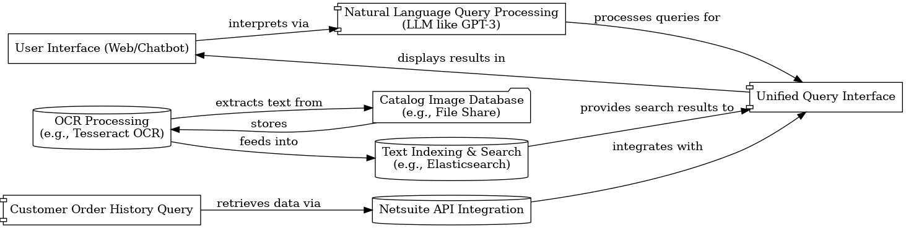

**Author**: Brandon Hoffman
**Date**: 03/10/2024

# Optimizing Parts Catalog Search and Order History Retrieval: A Comparative Look at Traditional and LLM-Enhanced Approaches

This document evaluates two technical approaches to address the need for searchable PNG/TIFF catalog images and integration with Netsuite for customer order history queries at a plumbing distributor. The challenge involves enabling natural language queries to effectively retrieve part diagrams, numbers, and order history, aiming to improve the efficiency of locating accurate part and order-related information.

### Background

Considering the technological advancements and the distributor's needs, two approaches have been developed. This comparative analysis provides a framework for implementation, emphasizing the advantages and considerations of incorporating technologies like OCR and LLM.

### Comparative Overview: Non-LLM vs. LLM Approach

Before diving into the specifics of each approach, it's important to understand the fundamental differences and how the addition of a Large Language Model (LLM) enhances the solution. Let's compare two possible solutions:

- **Non-LLM Approach:** Relies on direct text searches facilitated by Optical Character Recognition (OCR) technology and a structured query interface. This method emphasizes a more manual and direct form of query formulation, where users must input specific, structured queries to retrieve information. While this approach can be effective in reducing search times for experienced users familiar with the data structure, it lacks the intuitiveness and flexibility of natural language processing, potentially leading to a steeper learning curve and longer search times for complex queries.

- **LLM Approach:** Incorporates a Large Language Model to interpret and process natural language queries. This enhancement over the non-LLM approach allows users to interact with the system using conversational language, making the search process more intuitive and accessible. The LLM can understand complex queries, translate them into structured searches, and even integrate queries across different data sources (e.g., catalog images and Netsuite order history) seamlessly. This approach not only improves user experience by accommodating a wider range of query complexities but also leverages the ongoing advancements in AI to ensure the system becomes more accurate and efficient over time through learning and optimization.

### Without LLM: Enhancing Efficiency with Structured Data

The initial approach focuses on harnessing OCR to transform catalog images into a searchable database, prioritizing direct and structured queries. This method caters to the foundational need to retrieve part information and order history efficiently, albeit with a reliance on users' familiarity with data structures and their ability to formulate precise queries.

**Key Components**:
- OCR-driven text extraction from catalog images.
- A searchable database for indexing, like Elasticsearch.
- A user interface for structured query input.
- Netsuite API integration for direct access to order history.

**Limitations**:
While effective in specific scenarios, this approach might limit the query's natural flow and understanding, especially for those less versed in structured query language.

#### Requirements

- **Must Have:**
    - OCR processing to convert catalog images (PNG/TIFF) into searchable text.
    - A searchable database for indexed text (e.g., Elasticsearch).
    - Direct query interface for users to perform searches.
    - Integration with Netsuite API to access customer order history.
- **Should Have:**
    - A scalable cloud-based architecture to support the OCR and database services.
    - Basic security measures to protect sensitive data.
- **Could Have:**
    - A web interface for internal staff to make queries.
- **Won't Have:**
    - Natural language processing capabilities.
    - Prediction or analytics features related to order data.

**Architecture Diagram**

### With LLM: Bridging the Gap with Natural Language Processing

Elevating our strategy, the inclusion of an LLM signifies a shift towards understanding and processing queries as naturally posed by users.

#### Requirements

- **Must Have:**
    - OCR technology for converting catalog images into searchable text.
    - A searchable text database (e.g., Elasticsearch).
    - An LLM like GPT for interpreting natural language queries.
    - Netsuite API integration for accessing customer order history.
- **Should Have:**
    - A fine-tuned LLM model on industry-specific terms and queries for enhanced accuracy.
    - Cloud-based architecture for scalability and reliability.
    - A unified query interface that processes both catalog and Netsuite queries.
- **Could Have:**
    - A web-based interface or chatbot for query input.
    - User feedback mechanisms for continuous improvement of query accuracy.
- **Won't Have:**
    - Complex analytics or prediction capabilities related to the order history.

#### Method

**Technical Components:**

1. **OCR Processing:**
   - **Tool:** Tesseract OCR.
   - **Process:** converting image text for indexing.

2. **Text Indexing & Search:**
   - **Database:** Elasticsearch, identical in function to the Non-LLM but now queried indirectly through the LLM.

3. **Natural Language Query Processing:**
   - **Engine:** A fine-tuned version of GPT or a similar LLM.
   - **Function:** Interprets natural language queries, translating them into structured queries for Elasticsearch or Netsuite API calls.

4. **Netsuite Integration:**
   - **API:** SuiteTalk.
   - **Usage:** Accessed by the LLM to answer order history queries in natural language.

5. **User Interface:**
   - **Type:** Enhanced web interface or chatbot.
   - **Function:** Accepts natural language input, interacting with the LLM to process queries.

**Data Flow:**

1. Users submit natural language queries through the interface.
2. The LLM interprets these queries, deciding whether to fetch data from the text database or order history.
3. For catalog searches, the LLM formulates a query for Elasticsearch based on the OCR-processed text.
4. For customer orders, it generates a request to Netsuite via SuiteTalk.
5. Results are aggregated by the LLM and presented to the user in a coherent, conversational manner.

**Architecture Diagram:**

#### Implementation with Cost-Reduction Strategies

1. **Infrastructure Setup:**
   - **Action:** Utilize open-source OCR technology like Tesseract OCR for text extraction and Elasticsearch for text indexing. These tools offer robust capabilities without the licensing fees associated with proprietary software.
   - **Cost-Reduction:** Opt for cloud providers offering scalable, pay-as-you-go pricing models to minimize initial infrastructure costs. Use containerization (e.g., Docker) and orchestration tools (e.g., Kubernetes) to manage resources efficiently.

2. **LLM Integration and Fine-Tuning:**
   - **Action:** Integrate an open-source LLM framework, such as OpenAI's GPT-3.5, which can be used cheaply for our purposes and fine-tuning. This step involves training the model on domain-specific data to increase accuracy.
   - **Cost-Reduction:** Start with a smaller model variant to reduce computing resource needs during the fine-tuning phase, scaling up as necessary based on POC outcomes.

3. **User Interface (Web/Chatbot) Development:**
   - **Action:** Develop a basic yet functional user interface to interact with the system using open-source web frameworks. This interface should support simple natural language queries and display results clearly.
   - **Cost-Reduction:** Use agile development practices to focus on core functionalities first, enabling rapid deployment and iteration based on user feedback.

4. **OCR Processing and Data Indexing Pipeline:**
   - **Action:** Establish a workflow that automates the conversion of catalog images to searchable text and indexes this text in Elasticsearch, leveraging cloud-based storage for scalability.
   - **Cost-Reduction:** Implement a batch processing schedule during off-peak hours to take advantage of lower computing costs.

5. **Netsuite API Integration and Query Handling:**
   - **Action:** Develop integration with Netsuite's SuiteTalk API to fetch customer order history, ensuring queries can pull relevant data efficiently.
   - **Cost-Reduction:** Optimize API calls to minimize unnecessary data retrieval, reducing processing time and costs.

6. **Testing, Training, and Optimization:**
   - **Action:** Conduct iterative testing cycles to refine OCR accuracy, LLM query processing, and overall system performance. Gather user feedback for continuous improvement.
   - **Cost-Reduction:** Utilize synthetic datasets alongside real catalog images for initial testing phases to minimize data preparation expenses.

#### Milestones for POC and Beyond

1. **POC Development and Initial Testing:** Complete basic setup and test with a limited dataset.
2. **Feedback Incorporation and Feature Enhancement:** Refine POC based on internal feedback, focusing on critical functionalities.
3. **Extended Testing with Real Data:** Validate POC with a broader dataset, engaging end-users for feedback.
4. **Evaluation and Planning for Full-scale Implementation:** Assess POC outcomes, user feedback, and cost implications for scaling up.
5. **Launch of Enhanced Version:** Based on POC success, develop and deploy a more robust version incorporating advanced features and optimizations.

